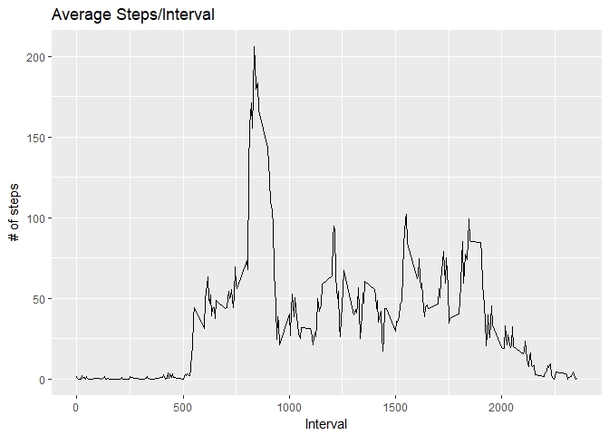
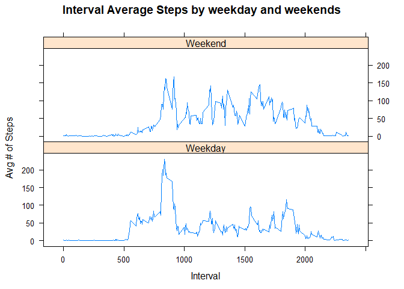

--- 
title: "Reproducible Research: Project 1"
author: "Kiefer Maddex"
date: 'NOV 12, 2017'
output: 
  html_document:
    keep_md: true
---


## Load and process data
* Load the data with read.csv() and format the data for analysis.


```r
data <- read.csv("activity.csv", header = TRUE, na.strings = "NA")
data$date <- as.Date(data$date, "%Y-%m-%d")
data <- as.data.frame(data)
```

### What is mean total number of steps taken per day?

1. Calculate the total number of steps taken per day


```r
#Aggregate steps by date
maxsteps <- aggregate(data$steps ~ data$date, FUN=sum)
colnames(maxsteps)<- c("Date", "Steps")
head(maxsteps)
```

```
##         Date Steps
## 1 2012-10-02   126
## 2 2012-10-03 11352
## 3 2012-10-04 12116
## 4 2012-10-05 13294
## 5 2012-10-06 15420
## 6 2012-10-07 11015
```


2. Make a histogram of the total number of steps taken each day


```r
#Plot histogram
hist(x=maxsteps$Steps, col="gray", breaks=50, xlab="Daily Total Steps", ylab="Frequency",
     main="Daily Total Step Distribution (missing data omitted)")
```

<!-- -->


3. Calculate and report the mean and median of the total number of steps taken per day
  
  Mean 

```r
mean_steps   <- as.integer(mean(maxsteps$Steps, na.rm=TRUE))
mean_steps
```

```
## [1] 10766
```

  Median

```r
median_steps   <- as.integer(median(maxsteps$Steps, na.rm=TRUE))
median_steps
```

```
## [1] 10765
```


## What is the average daily activity pattern?

1. Make a time series plot (i.e. type = "l") of the 5-minute interval (x-axis) and the average number of steps taken, averaged across all days (y-axis)


```r
Avg_Int <- data %>% filter(!is.na(steps)) %>% group_by(interval) %>% summarise(avg_steps = mean(steps))
g <- ggplot(Avg_Int, aes(x = interval , y = avg_steps)) 
g + geom_line() +   labs(title="Average Steps/Interval", x = "Interval", y = "# of steps")
```

<!-- -->


2. Which 5-minute interval, on average across all the days in the dataset, contains the maximum number of steps?


```r
interval <- as.integer(Avg_Int[which.max(Avg_Int$avg_steps),][1])
maxsteps <- as.integer(Avg_Int[which.max(Avg_Int$avg_steps),][2])
```

The maximum number of steps is at interval 835 with 206 steps


## Imputing missing values


1. Calculate and report the total number of missing values in the dataset (i.e. the total number of rows with NAs)

```r
Total_NAs <- sum(is.na(data$steps))
Total_NAs
```

```
## [1] 2304
```


2. Devise a strategy for filling in all of the missing values in the dataset. The strategy does not need to be sophisticated. For example, you could use the mean/median for that day, or the mean for that 5-minute interval, etc.

```r
Imputed <- merge(data, Avg_Int, by = "interval" , by.all = FALSE) 
Imputed$steps[is.na(Imputed$steps)] <- Imputed$avg_steps[is.na(Imputed$steps)]
Imputed <- Imputed[names(data)]
```


3. Create a new dataset that is equal to the original dataset but with the missing data filled in.

```r
head(Imputed)
```

```
##      steps       date interval
## 1 1.716981 2012-10-01        0
## 2 0.000000 2012-11-23        0
## 3 0.000000 2012-10-28        0
## 4 0.000000 2012-11-06        0
## 5 0.000000 2012-11-24        0
## 6 0.000000 2012-11-15        0
```


4. Make a histogram of the total number of steps taken each day and Calculate and report the mean and median total number of steps taken per day. Do these values differ from the estimates from the first part of the assignment? What is the impact of imputing missing data on the estimates of the total daily number of steps?

```r
Totalsteps <- Imputed%>% filter(!is.na(steps)) %>% group_by(date) %>% summarise( total_steps = sum(steps))
ggplot(Totalsteps, aes(x = total_steps)) + geom_histogram(fill = "grey" ,color = "black", binwidth = 1000) + 
  labs(title="Steps/Day (Histogram)", x = "# of Steps/Day", y = "# of days")
```

<!-- -->

  Mean

```r
steps_day_mean   <- as.integer(mean(Totalsteps$total_steps, na.rm=TRUE))
steps_day_mean
```

```
## [1] 10766
```
  
  Median

```r
steps_day_median <- as.integer(median(Totalsteps$total_steps, na.rm=TRUE))
steps_day_median
```

```
## [1] 10766
```


##Are there differences in activity patterns between weekdays and weekends?

1. Create a new factor variable in the dataset with two levels 'weekday' and 'weekend' indicating whether a given date is a weekday or weekend day.


```r
Imputed$weekday <- as.factor(ifelse(weekdays(Imputed$date) %in% 
                                      c("Sunday", "Saturday"),"Weekend","Weekday"))
```

2. Make a panel plot containing a time series plot (i.e. type = "l") of the 5-minute interval (x-axis) and the average number of steps taken, averaged across all weekday days or weekend days (y-axis). 


```r
Avg_Interval <- Imputed  %>% group_by(weekday, interval) %>% summarise( avg_steps = mean(steps))
with( Avg_Interval, xyplot( avg_steps ~ interval | weekday, type = "l",layout = c(1,2), 
                                  main = "Interval Average Steps by weekday and weekends",
                                  xlab = "Interval", ylab = "Avg # of Steps"))
```

<!-- -->

Weekday mornings are more active than weekends.


